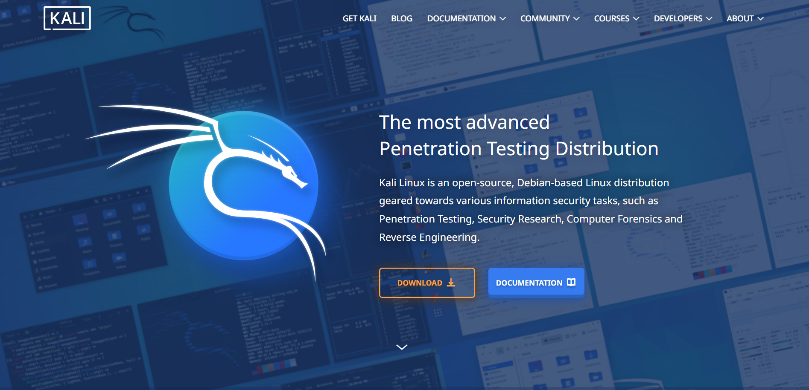
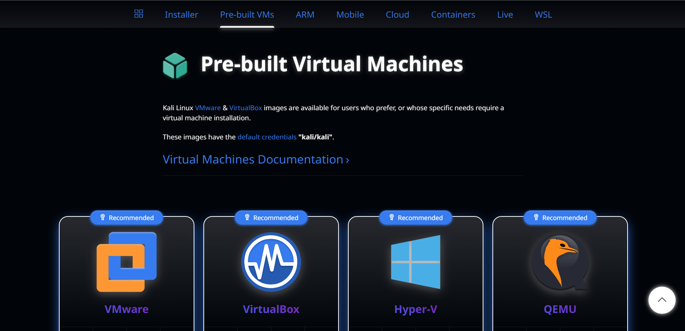
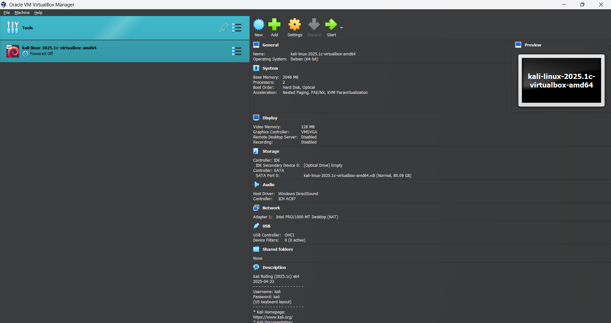

# Network-Based Intrusion Detection System Using Snort

**Author:** [Your Name]  
**Environment:** Kali Linux (Oracle VirtualBox)  
**Tool Used:** Snort (Open-Source NIDS)  
**Classification:** Educational / Portfolio Project

---

## 1. Introduction

With the growing complexity and volume of cyber threats, ensuring the security of computer networks has become a significant concern. One essential defense mechanism in modern network security is the Intrusion Detection System (IDS), which helps identify unauthorized access and malicious activities within a network environment.

This project focuses on a Network-Based Intrusion Detection System (NIDS), designed to monitor traffic across a network in real time. Unlike host-based systems, NIDS analyze data packets as they move through the network infrastructure, making them effective in detecting threats such as scanning, spoofing, and exploitation attempts.

**Snort**, a popular open-source NIDS developed and maintained by Cisco, was used for this project. Snort captures network traffic and compares it against a set of predefined rules to detect abnormal or harmful behavior, functioning as a packet sniffer, logger, and real-time intrusion detector.

---

## 2. Motivation

- **Evolving Threats** — conventional security measures are increasingly inadequate against sophisticated attacks.
- **Cost-Effectiveness** — Snort is a free, open-source solution.
- **Customization** — rule-based detection can be tailored to specific network environments and threat types.

---

## 3. Scope

The scope of this project includes:

- Deployment of Snort in a test network environment for real-time traffic analysis.
- Configuration and customization of Snort rules to detect specific types of network-based intrusions.
- Monitoring and logging of network traffic, with alerts generated upon detection of anomalies or malicious behavior.
- Analysis of detected threats to understand attack patterns and improve network defenses.

---

## 4. Lab Setup

### 4.1 Installing Kali Linux on Oracle VirtualBox

**Prerequisites:**
- Oracle VirtualBox installed ([virtualbox.org](https://www.virtualbox.org))
- Kali Linux ISO ([kali.org](https://www.kali.org))

**Steps:**
1. Download the Kali Linux ISO (64-bit recommended) from the official site.
2. Open VirtualBox → click **New**.
3. Configure VM settings:
   - Name: `Kali Linux`
   - Type: `Linux`
   - Version: `Debian (64-bit)`
4. Complete VM configuration and boot into Kali.
5. Login with default credentials: `kali / kali`

| Step | Screenshot |
|---|---|
| Kali download page |  |
| Pre-built VM options |  |
| VirtualBox Manager |  |
| Kali login screen |  |
| Kali desktop |  |

---

## 5 Installing Snort on Kali Linux

**Step 1 — Install Snort:**
```bash
sudo apt install snort
```
[Snort Install](./screenshots/fig6-snort-install.png). |

**Step 1 — Edit Local Rules:**
```bash
cd /etc/snort/rules
sudo nano local.rules
```
***Add a custom rule to detect ICMP traffic:***
```bash
alert icmp any any -> any any (msg:"ICMP Packet Detected"; sid:1000001; rev:1;)
```
**Step 3 — Configure Detection in snort.lua:**
```bash
cd /etc/snort
sudo nano snort.lua
```
***Locate the 5. configure detection section and update the ips block:***
```bash
ips = {
    rules = [[ include /etc/snort/rules/local.rules ]],
    variables = default_variables
}
```

## 6. Detection Using Snort

**Step 1 — Check Interface / IP:**

```bash
ip a
```
***Confirms the active network interface (typically eth0).***

**Step 2 — Start Snort:**

```bash
snort -c /etc/snort/snort.lua -i eth0 -A alert-fast
```

**Step 3 — Generate ICMP Traffic:**

```bash
ping 8.8.8.8
```

**Step 4 — View Alerts:**

```bash
"ICMP Packet Detected"
```

## 7. Conclusion

This project demonstrated the practical implementation of a Network-Based Intrusion Detection System (NIDS) using Snort. Through installation and configuration on Kali Linux within a virtualized environment, the project showed how real-time monitoring and rule-based detection can identify malicious activity on a network.

Hands-on work with Snort provided insight into how intrusion detection systems operate — from packet capture to rule-based alerting. By customizing detection rules (e.g., ICMP detection) and analyzing alert logs, the system proved effective at flagging unauthorized access attempts, scans, and other suspicious traffic.

This reinforced theoretical IDS concepts while highlighting the value of open-source tools like Snort in building cost-effective, scalable network defense capabilities.


## 8. Tools & Environment

- **Hypervisor** — Oracle VirtualBox
- **OS** — Kali Linux (Debian-based)
- **IDS Tool** — Snort (open-source NIDS, maintained by Cisco)
- **Test Traffic** — ICMP (ping) used to validate detection

